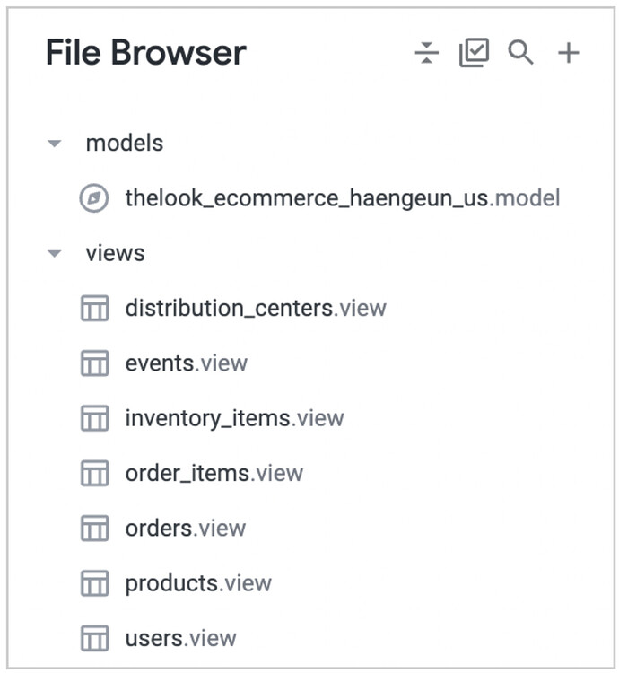
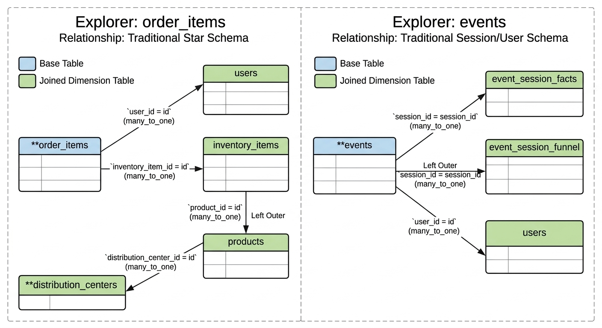

# 00_ecommerce_looker

This folder contains examples of LookML files connected to the BigQuery Public Dataset: [theLook eCommerce](https://console.cloud.google.com/marketplace/product/bigquery-public-data/thelook-ecommerce).
"LookML is essentially a SQL abstraction. Folks using Looker for BI purposes can write the language vs. writing sushi-grade SQL." (https://whynowtech.substack.com/p/malloy-data)

---

## Project Overview
This repository demonstrates a **Traditional Star Schema** setup within Looker (It can be any BI tool). 

Following the [blueprint for a scalable LookML layered structure](https://discuss.google.dev/t/a-blueprint-for-scalable-lookml-layered-structure/193354), the project is organized into distinct layers:

### 1. Views (`/views`)
Each file represents an underlying database table where specific dimensions and measures are defined. Based on the project structure, the following views are included:
* `distribution_centers.view`
* `events.view`
* `inventory_items.view`
* `order_items.view`
* `orders.view`
* `products.view`
* `users.view`

### 2. Models (`/models`)
The model files define:
* **A. The database connection:** Specifies which BigQuery project and dataset to use.
* **B. The Explores (JOINS):** Defines how different views join together to form the user-facing interface.

---

